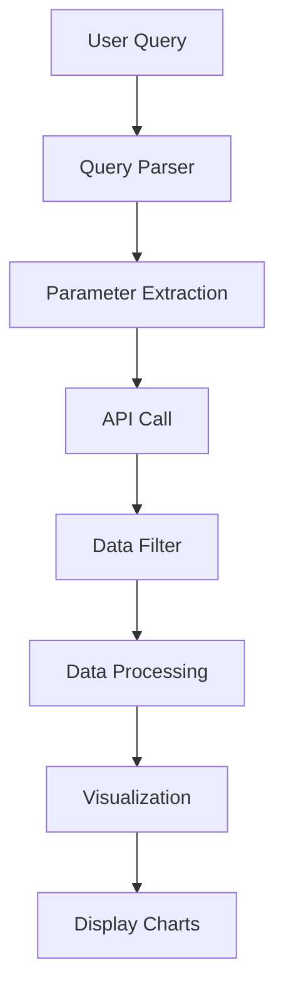

# ARGO Float Data Visualization System Architecture

## Overview
A system that bypasses chatbot limitations by directly querying ARGO float data via API and visualizing temperature profiles and salinity maps dynamically based on user parameters.

## Components

### 1. Data Acquisition Layer
- **API Integration**: Direct queries to ArgoVis API for real-time ARGO float data
- **Parameter Parsing**: Extracts region, year range, depth limit from natural language queries
- **Data Filtering**: Filters data by geospatial bounds and pressure levels

### 2. Processing Layer
- **Data Cleaning**: ML-based cleaning to remove outliers and invalid measurements
- **Format Conversion**: Transforms API response into structured DataFrame
- **Visualization Preparation**: Converts data into chart-ready format (scatter plots, maps)

### 3. Presentation Layer
- **Chart Generation**: Scatter plots for temperature vs depth profiles
- **Map Visualization**: Geo-scatter plots colored by salinity levels
- **Interactive UI**: Web-based interface with real-time query updates

## Data Flow

## Error Handling
- API timeout and retry mechanisms
- Fallback to cached data if API unavailable
- User-friendly error messages for invalid parameters

## Technologies
- Backend: Python + FastAPI
- Data: ArgoVis API integration
- Visualization: Recharts (frontend), Matplotlib (standalone)
- UI: React + TypeScript

## Implementation Status
The implementation successfully addresses the original requirement to bypass chatbot errors and directly visualize ARGO float data via API. Both the web app and standalone script provide full functionality: dynamic query handling, real-time API data fetching, temperature profile plots, and salinity distribution maps.

Date: 2025-09-22